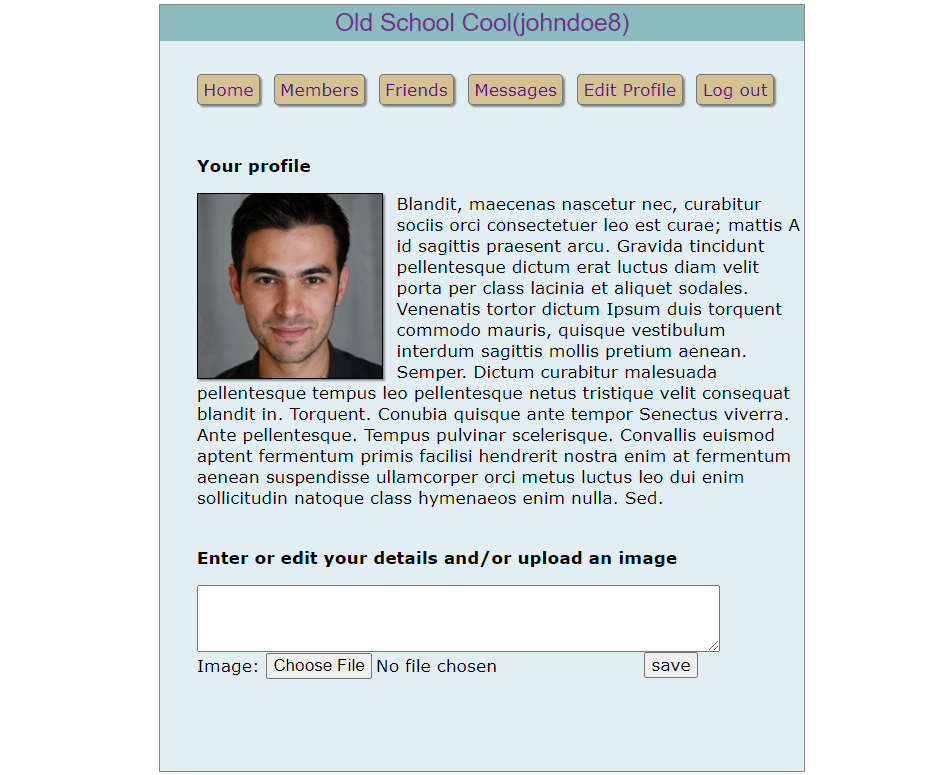
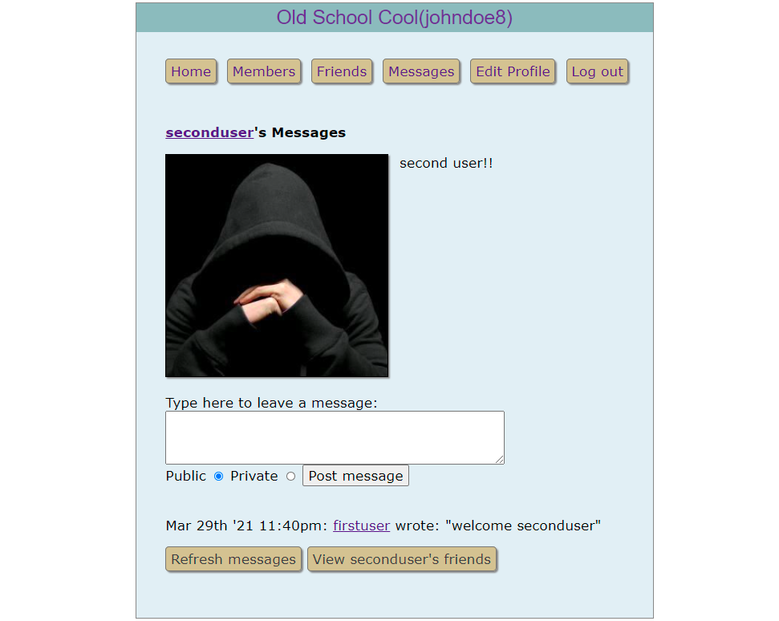
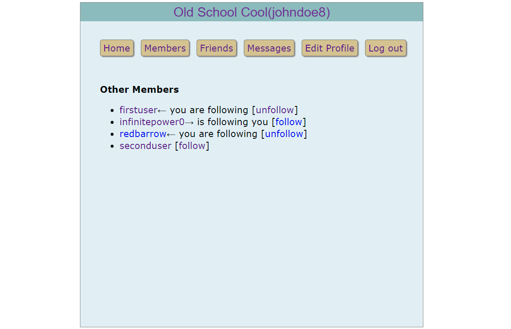

# Learning PHP by doing a project

An old school social network site built using HTML, CSS, Javascript, PHP and MySQL that implements all the CRUD operations.

[click here](https://obscure-forest-14850.herokuapp.com/) to open the web app

## Features:

- Sign up process
- Login/Logout facility
- Session control
- Listing all members
- Add friends - follow/unfollow
- Message other members and view messages
- Profile view - with a picture and description

## How to Run

- Clone the repo
- Install any [WAMP](https://ampps.com/wamp) stack and configure it
- Open the project directory in the server and start the server

## Built With

- HTML, CSS, Javascript - Frontend
- PHP 7.3.27 - Backend
- MySQL - Database
- [Easy PHP](https://www.easyphp.org/) - WAMP server
- [Heroku](https://heroku.com/) - Cloud platform for deployment

## Deployment Tutorial

[Deploying PHP and MySQL webapp with Heroku](https://scotch.io/@phalconVee/deploying-a-php-and-mysql-web-app-with-heroku)

## Screenshots

_Profile page_

_Messages page_

_Members page_

## Credits

[Robin Nixon](https://github.com/RobinNixon/lpmj6/tree/master/robinsnest)'s awesome book, [Learning PHP, MySQL, JavaScript, and CSS](https://www.amazon.com/Learning-MySQL-JavaScript-Step-Step/dp/1449319262)
